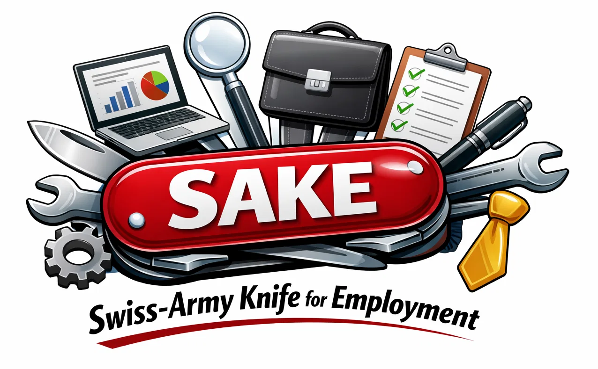

# SAKE – Swiss-Army Knife for Employment

  

---

**SAKE** is a modular, all-in-one toolkit designed to support job seekers navigating the employment landscape. From crafting resumes to optimizing LinkedIn profiles, SAKE serves as a multi-functional platform - just like a Swiss Army knife for your career.  
Currently under development.

---

## Features

- **[CV HOWTO & Builder](cv/README.md)** – Create professional CV in PDF from markdown file in minutes.
- **[LinkedIn HOWTO](linkedin/README.md)** – Analyze and improve your LinkedIn profile.
- More features to come in the future.

---

## Project Structure

```
project-root/
├── cv/
│   ├── md_converter/
│   │   ├── CV.md                 # Markdown version of the CV
│   │   ├── md_converter.py       # Python script for converting markdown to HTML
│   │   ├── metadata.txt          # Metadata to embed to the output PDF
│   │   ├── README.md             # Documentation for the converter
│   │   ├── requirements.txt      # Python dependencies
│   │   └── styles.css            # Styling for the CV output
│   └── README.md                 # Tips on how to create your awesome CV
├── linkedin/
│   ├── doc/
│   └── README.md                 # Documentation for LinkedIn-related features
├── LICENSE                       # License file for the project
└── README.md                     # Root-level project README
```