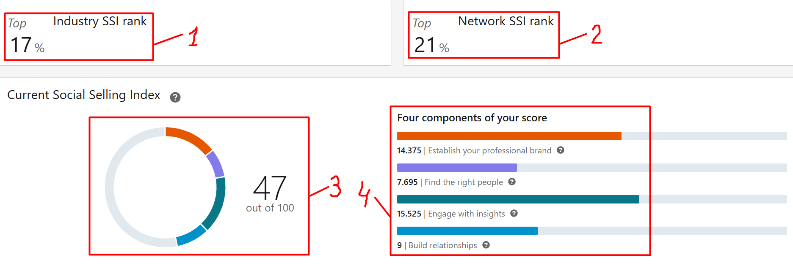
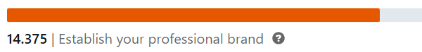
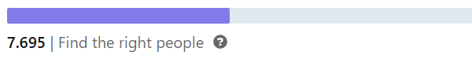
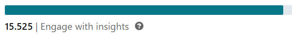
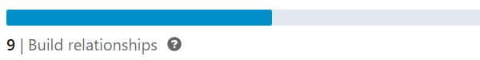

# Linkedin HOWTO

A strong LinkedIn presence can significantly boost your visibility to recruiters, hiring managers, and industry peers. This guide covers essential tips to improve your profile and increase your **Social Selling Index (SSI)**.

---

## What is SSI?

**SSI** stands for **Social Selling Index**. It is a score developed by LinkedIn that reflects how effectively your profile is being used as a tool to "sell" your personal brand - whether you're selling skills, services, or career potential. A high SSI score indicates that your profile is actively attracting the right audience, building trust, and creating opportunities through strategic engagement on the platform.
You could have asked - why do I need it if I'm not selling anything? Well, from LinkedIn perspective you are "selling" your skills and the higher your score - the higher should be your visibility (and the more chances that LinkedIn algorithms will put your profile instead of somebody else to recruiters, which is the target).

You can view your personal SSI score at:  
[https://www.linkedin.com/sales/ssi](https://www.linkedin.com/sales/ssi)  

The score ranges from **0 to 100** and is divided into **four key components** (each worth up to 25 points).

---

### SSI Score

  

On the above screenshot you can see next elements:
1. Your standing among other people from the same industry. The lower the value - the better.
2. Same, but for your network.
3. Your current SSI value.
4. "Four pillars" of the SSI.

As for the four key components - there are question signs to the right of each other which can give more info about them, but do not let them fool you. This description is very misleading and do not point to what you should do to build them up.

### **Establish Your Professional Brand**  

  

All the point of this component is to represent the completeness of your profile as a whole. Did you think that you can add experience and finish with that?  
Everything counts - every profile section. The minimum set of what you should fill in:
- Photo - good photo builds trust and no recruiter wants to waste time on the fake profile. At the times of remote work this is the common issue. 
- Headline - add the position you are looking for, the stack and years of experience so that recruiters will spend less time finding you while trying to fill in that role.
- Banner - here you can put basic information, essentially the same as in headline, but in visual form. Use [canva](https://www.canva.com/s/templates?query=linkedin+banner) or Sora to generate a template of your choice. Example of template for Sora you can find [here](res/linkedin_banner_prompt.txt).
- About - you can take this from your CV, just add the necessary skills as a text for the case your profile will be analyzed by parsers (it can give you extra score).
- Skills - add everything you worked with, try to make it to the upper limit which is 100.
- Experience - try to fill in every piece of experience if you have no reasons to not do that. From personal observation the more places you point - the better score you will get. Also, do not forget to add all relevant skills to each role you worked on - it will help recruiters to understand how much experience you have with each technology.
- Education - no comments, just add all the education you have got to the moment.
- Featured - add your files or posts of choice to show up before recruiters (or any other people which see your profile).
- Projects - any small pet project counts.  

Filling the above should give you the score of about 10. To get more - add any certifications that you have and ask you peer collegues to endorse your skills and write recommendations (the last 2 pieces I haven't checked myself, but endorsements seem to have a positive effect on the score while 1 recommendation didn't affect the score at all).
Once filled, the score added by this component stays the same and does not require active actions.

### **Find the Right People**  

  

This component reflects how often and "how effectively" you use/can use Linkedin search instruments. No more than that. It is hard to evaluate which exact actions affect this component how since it updates at least once a day or even less.  
But seems that if you have a couple of filters with set up daily notifications - you can have it at around 7.5 points while checking those filters daily. With subscription to Sales Navigator (which is pretty expensive compared to the functionality which it provides) and it's active usage you can have 4 extra points (more or less).  
If you stop doing required actions - the score will start to drop, so to get best results continue to do them on daily basis.

### **Engage with Insights**  

  

Requires more active actions than the rest of the components.
To contribute to it, you need to do 3 things:
- **Like** posts of other people in the feed. It is the least you can do and it gives less than 1 point.
- **Comment** other people's posts. It gives more than just likes, but still, not so much (maybe 1 point per comment or around that).
- Create new **posts**. Each new post can contribute to the score drastically. But how much - depends on **engagement**. This is the measure of how many times your post has been shown in other people's feeds. There is an opinion that posts which are published in the middle of the day and which will be liked/commented in the first 2 hours after publishing will get better visibility. So ask your colleagues to be ready to comment your post as soon as it is published (it shouldn't matter if they have seen it in their feeds or used the direct link, due to the Linkedin algorithms the former can take several hours or even days).
Having 1 post per week can allow to reach the score of around 12, but consistency is the key as it decays over time. 

### **Build Relationships**  

  

This score is hard to achieve in the beginning as it depends on the amount of connections. Each new connection adds aroun 0.025 points, but **heavily** depends on consistency. If you add new people to your network each day or two - this should not become a problem.  
Noticeable milestone which was observed from personal experience is that once you reach 200 people, it will leap from that 2-3 points which you had to around 8. To push it further you must continue adding new people. But it worth noting that seems that without communication via chats with other people, this score also stops growing. So find a buddy of your own with whom you will send posts or memes to each other every day. Or have a success among recruiters (but if you have that, probably you don't need to care about SSI anymore, right?).  
Another meaningful note is do not try to filter your feed by unfollowing people. I tried it once and unfollowed around 50 connections after which my score dropped from 12 to 8 and haven't recovered since than. In other words when you are widening your network and communicating with other people on a daily basis you should be fine and this score will grow, but just a step back - and you will be punished.  
On the other hand even if you stop adding people and chatting, the score will not drop, it just builds up over time.

---

## General Tips

- Make your LinkedIn URL simple and shareable, it also builds trust as it doesn't look like a profile created yesterday (which has a good chance to be fake):  
Example: `linkedin.com/in/gordon-clark`